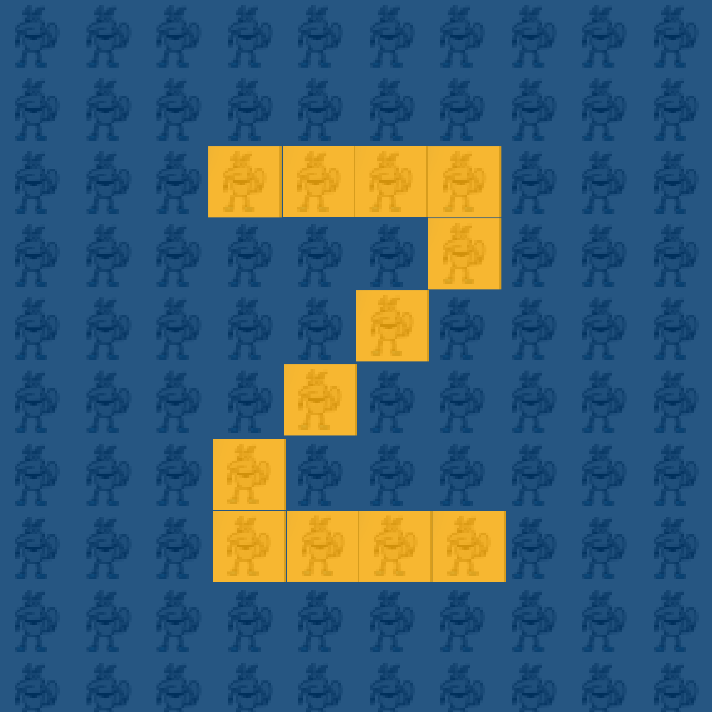

# **ZotDots** #

1. [Why ZotDots Was Created](#why-zotdots-was-created)
2. [How ZotDots Works](#how-zotdots-works)
3. [How to Play](#how-to-play)
4. [Contributors](#contributors)

## Why ZotDots Was Created ##
ZotDots was inspired by r/place to add to the sense of community within UCI and become a "New Beginning" as it starts with a blank canvas and becomes a beautiful artwork!

## How ZotDots Works ##
ZotDots utilizes Flask and an SQLAlchemy database to store and update pixels within our canvas.

## How To Play ##
One pixel can be placed once per minute.

When the timer is done counting you are able to select a color from the bottom of a screen and then press somewhere in our canvas to place it down.

Compete with other players to be the one to leave your mark!

Band together with your friends to make your Petr dreams come true!

## Contributors ##

The ZotDots team for WebJam 2022
- [Audrey Lam](https://github.com/alam7989)
- [Jason Yang](https://github.com/Pesra)
- [Priyansha Sharma](https://github.com/Priyansha0608)
- [Taylor Quach](https://github.com/taylorq1)

